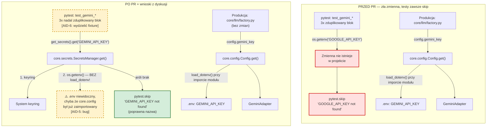

# PR #006: Ujednolicenie źródła `GEMINI_API_KEY` w testach integracyjnych Gemini

## 1. Kontekst i Cel (Makro)

* **Zadanie główne:** PR koryguje testy integracyjne `tests/core/test_gemini_integration.py`, które przed zmianą pobierały klucz API pod błędną nazwą zmiennej (`GOOGLE_API_KEY` przez `os.getenv`) — niezgodną z tym, czego faktycznie używa produkcyjne okablowanie adaptera (`core/llm/factory.py` czyta `config.gemini_key`, czyli `GEMINI_API_KEY`). Efekt uboczny: testy integracyjne prawie zawsze były cicho pomijane (`skip`), nawet gdy klucz był poprawnie skonfigurowany.
* **Stan zmian:** Sam PR to minimalna, 7-liniowa poprawka: trzy testy przełączono na `get_secrets().get("GEMINI_API_KEY")` (`core.secrets.SecretsManager`) i poprawiono treść komunikatu `pytest.skip`. Dyskusja w komentarzach poszła dalej niż diff i wskazała dwie rzeczy, których PR **nie** rozwiązuje: (1) `SecretsManager` używany w poprawce nie ładuje pliku `.env`, w przeciwieństwie do `core.config.Config`, którego faktycznie używa produkcja — więc naprawa może być tylko pozornie kompletna; (2) trzykrotna duplikacja bloku pobierania klucza + skip nadaje się do wspólnego fixture'a. Oba wątki trafiły jako osobne tickety do Linear (`AID-5`, `AID-6`).

## 2. Architektura: Przed i Po

**Jak czytać diagram:** lewa kolumna (PRZED) pokazuje, dlaczego testy integracyjne były praktycznie martwe — szukały zmiennej, która nigdzie w projekcie nie istnieje. Prawa kolumna (PO) pokazuje stan po PR: nazwa zmiennej jest już poprawna, ale ścieżka testowa (`SecretsManager`) i ścieżka produkcyjna (`Config`) to dwa różne komponenty z różną logiką ładowania `.env` — węzeł oznaczony ⚠️ to dokładnie to rozbieżność, którą opisuje `AID-5`.

## 3. Analiza Proponowanych Poprawek (Mikro)

### Poprawka: Zmiana źródła klucza z `os.getenv("GOOGLE_API_KEY")` na `get_secrets().get("GEMINI_API_KEY")` *(zawarta w PR)*
* **Problem:** Testy odczytywały zmienną `GOOGLE_API_KEY`, której nigdzie indziej w projekcie nie ma — produkcyjny kod (`core/llm/factory.py`) używa `GEMINI_API_KEY` przez `core.config`. Rezultat: testy integracyjne były w praktyce zawsze pomijane, dając fałszywe poczucie "zielonego" CI bez realnej weryfikacji integracji z Gemini API.
* **Mechanizm:** Podmiana wywołania na `get_secrets().get("GEMINI_API_KEY")` (`core.secrets.get_secrets()`) w trzech testach oraz korekta treści `pytest.skip(...)` tak, by odzwierciedlała faktyczną, sprawdzaną zmienną.
* **Wpływ (Blast Radius):** Ograniczony do `tests/core/test_gemini_integration.py`. Nie dotyka kodu produkcyjnego ani innych testów.
* **Analiza i Kompromisy (Trade-offs):** To słuszna, minimalna poprawka nazwy zmiennej — ale wybiera do odczytu inny komponent (`SecretsManager`) niż ten, którego faktycznie używa aplikacja (`Config`). Dwa równoległe mechanizmy dostępu do sekretów w jednym projekcie to źródło rozjazdu zachowań między testem a produkcją, co ujawnia się w kolejnej poprawce.

### Poprawka: [AID-5] `SecretsManager.get()` nie ładuje `.env` → możliwe fałszywe `skip` testów
* **Problem:** `core/secrets.py:46-67` sprawdza kolejno keyring i `os.getenv()`, ale nigdy nie wywołuje `load_dotenv()`. Ładowanie `.env` odbywa się wyłącznie w `core/config.py:23` jako efekt uboczny importu modułu. Jeśli proces testowy nie zaimportował `core.config` wcześniej (np. przez inny moduł), a klucz `GEMINI_API_KEY` jest ustawiony tylko w `.env` (nie w keyring ani prawdziwym env systemowym), test dostanie `None` i przejdzie w `skip` — mimo że konfiguracja jest poprawna. To dokładnie ten sam rodzaj cichej awarii, który PR miał naprawić dla `GOOGLE_API_KEY`, tylko jedno piętro niżej.
* **Mechanizm:** Zaproponowane w review dwie opcje napraw: (1) w testach użyć tej samej warstwy co produkcja — `from core.config import get_config; api_key = get_config().gemini_key`; (2) jawnie wywołać `load_dotenv()` w module testowym przed użyciem `get_secrets()`. Ticket zostawia też otwartą trzecią opcję: dodać `load_dotenv()` bezpośrednio do `SecretsManager.get()`, co usunęłoby tę klasę błędu w całym projekcie, nie tylko w tym teście.
* **Wpływ (Blast Radius):** Bezpośrednio `core/secrets.py` (potencjalna zmiana zachowania `SecretsManager.get()` dla *wszystkich* wywołań, nie tylko Gemini) oraz `tests/core/test_gemini_integration.py`. Pośrednio: każdy inny kod korzystający z `get_secrets()` zamiast `get_config()` dziedziczy to samo ryzyko (np. `SecretsManager.list()` w CLI keyring).
* **Analiza i Kompromisy (Trade-offs):** Opcja 1 (użyć `get_config()` w testach) jest najtańsza i najbardziej spójna — testuje dokładnie tę ścieżkę, którą przechodzi produkcja, kosztem odejścia od `SecretsManager` jako "źródła prawdy" dla testów sekretów. Opcja 2 (jawny `load_dotenv()` w teście) izoluje fix do warstwy testowej, ale duplikuje logikę już obecną w `core.config`. Opcja 3 (dodanie `load_dotenv()` do `SecretsManager.get()`) rozwiązuje problem systemowo, ale zaciera rozróżnienie między `SecretsManager` (keyring-first, do zarządzania sekretami) a `Config` (cache'owany, do odczytu w runtime) — dwa komponenty zaczynają robić to samo, co rodzi pytanie, czy nie powinny zostać scalone.

### Poprawka: [AID-6] Duplikacja logiki pobierania klucza + `skip` w trzech testach
* **Problem:** Blok `api_key = get_secrets().get("GEMINI_API_KEY")` / `if not api_key: pytest.skip(...)` jest powtórzony identycznie w `test_gemini_complete`, `test_gemini_complete_structured` i `test_gemini_with_system_prompt`. Przy każdej kolejnej zmianie (np. fix z `AID-5`) trzeba pamiętać o edycji w trzech miejscach.
* **Mechanizm:** Wydzielenie wspólnego pytest fixture (np. `gemini_api_key`), który centralizuje pobranie klucza i logikę `skip`, wstrzykiwanego do testów jako parametr.
* **Wpływ (Blast Radius):** Wyłącznie `tests/core/test_gemini_integration.py` (ew. nowy plik `conftest.py`, jeśli fixture ma być współdzielony szerzej). Zero wpływu na kod produkcyjny.
* **Analiza i Kompromisy (Trade-offs):** Sam recenzent (`qodo-code-review`) zaznacza, że to "więcej refaktoryzacji niż potrzeba dla poprawki jednej zmiennej" i że fixture może "zaciemnić warunek wstępny" dla prostego czytelnika testu. Wartość refaktoryzacji rośnie proporcjonalnie do liczby przyszłych testów Gemini — przy obecnych trzech testach to zmiana typu "przyjemne, ale nie pilne"; staje się zasadna, gdy plik urośnie.
