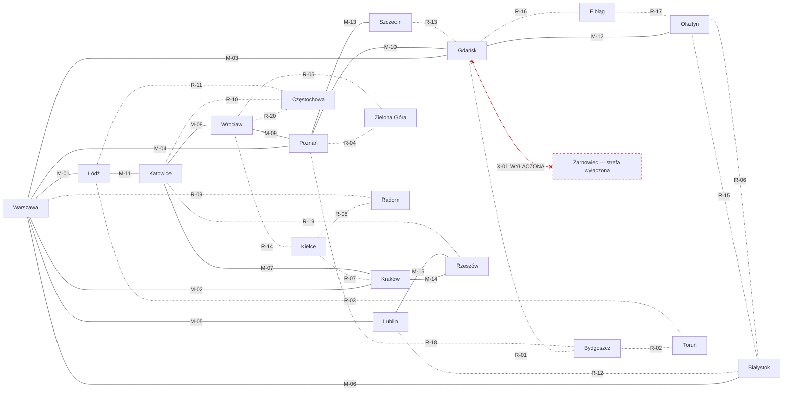

# Sieć SPK — graf połączeń (zweryfikowany)

Źródło prawdy: `system-przesylek-konduktorskich/index.md`, sekcja 3.1.1–3.1.2
(tabele "Trasy magistralne" / "Trasy regionalne"), oraz `trasy-wylaczone.png`.

⚠️ **NIE budować grafu z `zalacznik-F.md`.** Ten załącznik to "schemat uproszczony"
(sam się tak deklaruje w stopce) rysowany w ASCII — pomija 6 tras i ma 9 odcinków
z błędnymi końcami wynikającymi z ciasnoty rysunku. Szczegóły w sekcji "Rozbieżności".

## Trasy magistralne (M)

| Kod | Przebieg | Długość (km) | Przepustowość (wag/dobę) |
|---|---|---|---|
| M-01 | Warszawa – Łódź | 137 | 120 |
| M-02 | Warszawa – Kraków | 314 | 96 |
| M-03 | Warszawa – Gdańsk | 340 | 84 |
| M-04 | Warszawa – Poznań | 310 | 78 |
| M-05 | Warszawa – Lublin | 170 | 72 |
| M-06 | Warszawa – Białystok | 195 | 60 |
| M-07 | Kraków – Katowice | 79 | 108 |
| M-08 | Katowice – Wrocław | 191 | 84 |
| M-09 | Wrocław – Poznań | 174 | 72 |
| M-10 | Poznań – Gdańsk | 309 | 66 |
| M-11 | Łódź – Katowice | 198 | 72 |
| M-12 | Gdańsk – Olsztyn | 170 | 48 |
| M-13 | Poznań – Szczecin | 210 | 54 |
| M-14 | Kraków – Rzeszów | 164 | 60 |
| M-15 | Lublin – Rzeszów | 172 | 48 |

## Trasy regionalne (R)

| Kod | Przebieg | Długość (km) | Przepustowość (wag/dobę) |
|---|---|---|---|
| R-01 | Gdańsk – Bydgoszcz | 164 | 42 |
| R-02 | Bydgoszcz – Toruń | 47 | 36 |
| R-03 | Toruń – Łódź | 210 | 36 |
| R-04 | Poznań – Zielona Góra | 155 | 30 |
| R-05 | Wrocław – Zielona Góra | 156 | 30 |
| R-06 | Białystok – Olsztyn | 213 | 24 |
| R-07 | Kielce – Kraków | 118 | 36 |
| R-08 | Kielce – Radom | 84 | 30 |
| R-09 | Radom – Warszawa | 102 | 42 |
| R-10 | Częstochowa – Katowice | 98 | 36 |
| R-11 | Częstochowa – Łódź | 130 | 30 |
| R-12 | Lublin – Białystok | 260 | 24 |
| R-13 | Szczecin – Gdańsk | 362 | 30 |
| R-14 | Wrocław – Kielce | 282 | 24 |
| R-15 | Olsztyn – Białystok | 213 | 24 |
| R-16 | Gdańsk – Elbląg | 62 | 36 |
| R-17 | Elbląg – Olsztyn | 105 | 30 |
| R-18 | Bydgoszcz – Poznań | 139 | 36 |
| R-19 | Katowice – Rzeszów | 248 | 30 |
| R-20 | Wrocław – Częstochowa | 196 | 24 |

**Uwaga:** R-06 i R-15 to ten sam odcinek Białystok–Olsztyn o identycznych
parametrach (213 km, 24 wag/dobę) — w grafie to krawędź równoległa, nie błąd odczytu.

## Trasy wyłączone (X)

Z `trasy-wylaczone.png`. Tylko X-01 dotyka sieci z tabel powyżej; pozostałe
prowadzą do miast spoza 19-węzłowej sieci SPK.

| Kod | Przebieg | Powód |
|---|---|---|
| X-01 | Gdańsk – Żarnowiec | NIEJAWNY (Dyrektywa Specjalna 7.7) |
| X-02 | Wejherowo – Żarnowiec (odgałęzienie) | NIEJAWNY (Dyrektywa Specjalna 7.7) |
| X-03 | Lębork – Żarnowiec (odgałęzienie pomocnicze) | NIEJAWNY (Dyrektywa Specjalna 7.7) |
| X-04 | Krokowa – Żarnowiec (szlak techniczny) | NIEJAWNY (Dyrektywa Specjalna 7.7) |
| X-05 | Legnica – Jawor | Zniszczenie mostu na Kaczawie |
| X-06 | Przemyśl – granica wschodnia | Strefa buforowa |
| X-07 | Szczecin – granica zachodnia | Strefa buforowa |
| X-08 | Tarnów – Nowy Sącz | Osunięcie terenu |

## Graf

Linia ciągła = magistrala (M), kropkowana = regionalna (R), czerwona przerywana =
trasa wyłączona (X).

## Rozbieżności: `zalacznik-F.md` vs tabele w `index.md`

ASCII-art w załączniku F został przepisany wiernie, ale sam załącznik jest niezgodny
z tabelami. Rozbieżności wykryte przy porównaniu 1:1:

**Brakujące trasy (6):** M-03, M-09, M-11, M-13, R-14, R-15 nie występują na schemacie.

**Błędne końce odcinków (9):**

| Kod | Schemat F mówi | Tabela mówi |
|---|---|---|
| M-02 | Łódź – Katowice | Warszawa – Kraków (Łódź–Katowice to M-11) |
| M-05 | Warszawa – węzeł | Warszawa – Lublin |
| M-08 | Wrocław – Kraków | Katowice – Wrocław |
| M-12 | węzeł – Częstochowa | Gdańsk – Olsztyn |
| R-03 | Toruń – węzeł | Toruń – Łódź |
| R-05 | Zielona Góra – Białystok | Wrocław – Zielona Góra |
| R-06 | Olsztyn – węzeł | Białystok – Olsztyn |
| R-07 | Katowice – Kielce | Kielce – Kraków |
| R-18 | Bydgoszcz – Olsztyn | Bydgoszcz – Poznań |

**Węzeł-widmo:** w ASCII cztery trasy (R-03, R-06, M-05, M-12) zbiegają się w jednym
nienazwanym punkcie. To artefakt kompresji rysunku — w tabelach każda z tych czterech
tras łączy dwa konkretne miasta i żadna nie przechodzi przez wspólny węzeł.
Zbiór miast (20 z Żarnowcem) zgadza się między oboma źródłami; rozjeżdżają się
wyłącznie krawędzie.
