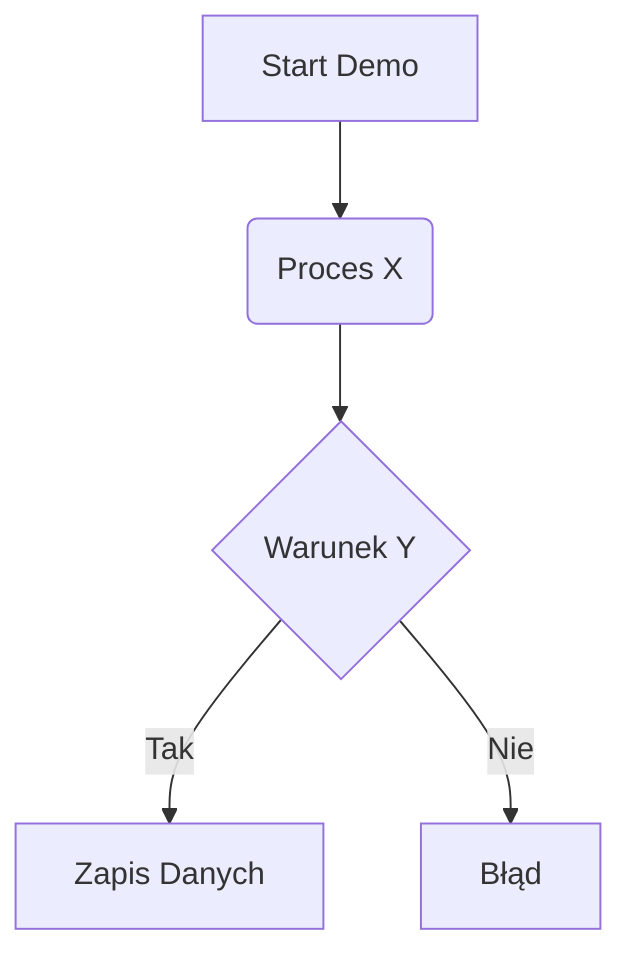

---
# Wymagany przez Dataview frontmatter w postaci listy słowników.
# Przykłady typów (relations): "requires", "extends", "complements", "similar"
edges:
  - { to: "[[Węzeł Docelowy 1]]", type: "typ relacji" }
  - { to: "[[Węzeł Docelowy 2]]", type: "typ relacji" }

tags:
  - "#demo"
  - "#ai-devs-4"
  - "#zastąpienie_tu_odpowiednim_tagiem_np_rag"

# Parametry ułatwiające filtrowanie w tabelach Dataview
difficulty_python: "Łatwy/Średni/Trudny"
core_tech_ts: ["zod", "bun", "langchain"]
core_tech_py: ["pydantic", "fastapi", "langchain-core"]
status: "to-do / done"
associated_task: "s01e01"
---

# Karta Dema: {{ Tytuł z pliku }}

## 📌 Krótki i Zwięzły Opis
*Jakie jest zadanie i po co w ogóle powstało to repozytorium demo?*
(Opisz to w 2-3 zdaniach wydestylowanych przez Gemini).

## 💻 Technologia
**Trudność przepisania (Risk Assessment):**
*Ocena, czy lepiej przepisać 1:1, czy użyć jako luźnej inspiracji do zrobienia tego po swojemu.*

**Kompatybilność z infrastrukturą `aid4u`:**
- **Konflikty:** (np. w demo użyli natywnego pobierania, my mamy system cachingowy)
- **Brakujące elementy:** (czego demo nie implementuje, a hub kursowy tego wymaga)
- **Spójność:** Jak bardzo pasuje do `core/llm`?

## ⚙️ Gotowe Fragmenty Logiki (Serce Algorytmu)
*Zwięzłe opisy jak działa pipeline. Unikać wklejania 1000 linii kodu TS, a wyciągnąć samo gęste.*

## 📐 Architektura (Mermaid)

## 🔗 Powiązania Symbiotyczne (Mapowanie Zastosowań)
*Do jakich zadań to konkretnie się przyda i w jakich obszarach to zaimplementować?*
- Pasuje do zadań z analizą grafów.
- Posiada zależności (patrz frontmatter `edges`) do innych dem w systemie.
