---
tags:
  - "#demo"
  - "#ai-devs-4"
  - "#multimodal"
  - "#s01e04"
core_tech_ts:
  - "@google/genai"
  - "openrouter"
  - "replicate"
  - "puppeteer"
core_tech_py:
  - "google-genai"
  - "replicate"
  - "pyppeteer / playwrite"
status: completed
associated_task: s01e04
demo_id: s01e04_demos_summary
---

# Podsumowanie Dem s01e04 – Architektura i Tricki Multimodalne (4th-devs)

## 📌 Krótki Opis
Zestaw 8 dem z lekcji `s01e04` prezentujących zaawansowane wykorzystanie modeli multimodalnych (Gemini API, OpenRouter, Replicate Kling) do obsługi audio, edycji i generowania obrazów z pętlą Visual QA, templatyzacji JSON, klasyfikacji z groundingiem wiedzy, generowania raportów PDF oraz analizy i syntezy wideo na bazie klatek kluczowych.

---

## ⚙️ Serce Algorytmu i Szczegóły Dem

### 1. `01_04_audio` (Audio Understanding & Speech Synthesis)
- **Architektura**:
  - Dwuścieżkowa obsługa plików audio: pliki `<20MB` przekazywane jako inline base64 (`inline_data`), a pliki `>20MB` ładowane do Gemini Files API przez dwuetapowy Resumable Upload protocol (`X-Goog-Upload-Protocol: resumable`), zwracający `fileUri`.
  - Transkrypcja i analiza audio z użyciem `gemini-2.5-flash-preview` i wymuszaniem ustrukturyzowanego JSON schema (`response_mime_type: "application/json"`, `response_schema`).
  - Synteza mowy za pomocą `gemini-2.5-flash-preview-tts` z podziałem na single-speaker oraz multi-speaker TTS (`multiSpeakerVoiceConfig` mapujący nazwy spikerów na głosy).
- **Tricki Multimodalne**:
  - **Diarizacja i analiza emocji w 1 wywołaniu LLM**: Gemini przyjmuje audio + prompt i zwraca ustrukturyzowany JSON z podziałem na spikerów, znacznikami czasu MM:SS, wybraną emocją (`happy`, `sad`, `angry`, `neutral`) i automatycznym tłumaczeniem na język docelowy.
  - **Multi-speaker TTS**: Wywoływanie modelu TTS z tablicą `speakerVoiceConfigs` przypisującą unikalne barwy głosu (np. Kore, Puck, Zephyr) poszczególnym postaciom w skrypcie.

---

### 2. `01_04_image_editing` (Edycja Obrazów z Pętlą Quality Assurance)
- **Architektura**:
  - Dual backend dla generowania obrazów: OpenRouter (`google/gemini-3.1-flash-image-preview`) lub Gemini Native API (`gemini-2.5-flash-preview`).
  - Edycja obrazów referencyjnych: funkcja przyjmuje instrukcje tekstowe oraz 1 lub więcej obrazów źródłowych (base64 data URL).
  - Pętla walidacji jakościowej (Visual QA): narzędzie `analyze_image` uruchamia model Vision z celowanym promptem oceniającym.
- **Tricki Multimodalne**:
  - **Pętla automatycznej korekty (Accept/Retry Loop)**: Model Vision ocenia 6 wymiarów jakościowych (`prompt_adherence`, `visual_artifacts`, `anatomy`, `text_rendering`, `style_consistency`, `composition`) i zwraca wygenerowany werdykt `VERDICT: ACCEPT/RETRY`, `BLOCKING_ISSUES`, `MINOR_ISSUES` oraz `NEXT_PROMPT_HINT`. Agent dokonuje ponownej próby generowania tylko przy wystąpieniu krytycznych `BLOCKING_ISSUES`.

---

### 3. `01_04_image_guidance` (Generowanie Obrazów Sterowane Pozą i Szablonem JSON)
- **Architektura**:
  - Łączenie ustrukturyzowanego promptu w formacie JSON (`workspace/template.json`) z obrazem referencyjnym pozy (`walking-pose.png`).
  - Agent modyfikuje wyłącznie sekcję `subject` w pliku JSON, pozostawiając resztę szablonu (styl, paleta barw, kompozycja, tło, oświetlenie, twarde reguły constraint/negative prompt) niezmienioną.
- **Tricki Multimodalne**:
  - **JSON Prompt + Pose Reference Image**: Przekazywanie całego skondensowanego obiektu JSON jako tekst instrukcji równolegle z plikiem graficznym `walking-pose.png`. Model traktuje obraz jako wzorzec geometrii/pozy postaci, a JSON jako ścisły specyfikator stylu graficznego (np. cell-shading, grube obrysy, brak gradientów).

---

### 4. `01_04_image_recognition` (Klasyfikacja Obrazów z Groundingiem Wiedzy Zewnętrznej)
- **Architektura**:
  - Klasyfikacja i sortowanie plików graficznych w `images/` na podstawie zewnętrznej bazy wiedzy tekstowej zlokalizowanej w `knowledge/*.md`.
  - Natywne narzędzie `understand_image` przyjmuje ścieżkę do pliku graficznego oraz specyficzne pytanie analityczne.
- **Tricki Multimodalne**:
  - **Wiedza Zewnętrzna + Vision Grounding**: Agent wczytuje profile postaci z plików markdown (np. `adam.md`, `mateusz.md`), a następnie porównuje je z odpowiedziami zwróconymi z wywołań Vision API, co pozwala na bezbłędne sortowanie zdjęć do właściwych podfolderów `images/organized/<category>/`.

---

### 5. `01_04_json_image` (Powtarzalne Promptowanie Obrazów przez Szablony JSON)
- **Architektura**:
  - Wykorzystanie szablonów JSON do budowania powtarzalnych, modularnych promptów dla modeli generatywnych obrazu.
  - Zamiast ciągłych promptów tekstowych, agent modyfikuje w pliku `template.json` jedynie węzły reprezentujące obiekt, utrzymując niezmienną część określającą estetykę, kadrowanie i ograniczenia.
- **Tricki Multimodalne**:
  - **Token-Efficient Prompt Template**: Przekazywanie zserializowanego JSON bezpośrednio do interfejsu generowania obrazów eliminuje niespójności stylu i ogranicza hallucination (gwarantuje wymuszenie negatywnych promptów oraz technicznych zasad renderowania).

---

### 6. `01_04_reports` (Automatyczna Generacja Raportów PDF z Elementami Multimodalnymi)
- **Architektura**:
  - Pipeline raportowy: Odczyt szablonu HTML (`workspace/template.html`) i przewodnika stylu md -> Wygenerowanie dedykowanych ilustracji narzędziem `create_image` -> Zapis kompletnego dokumentu HTML w `workspace/html/` -> Konwersja do PDF z użyciem Puppeteer.
- **Tricki Multimodalne**:
  - **Pętla HTML-to-PDF z dynamicznymi obrazami AI**: Puppeteer uruchamiany w trybie headless ładuje lokalny plik z protokołem `file://`, oczekując na załadowanie wszystkich zaalokowanych ilustracji AI (`waitUntil: "networkidle0"`), po czym renderuje wysokiej jakości wydruk PDF (A4, tło, marginesy).

---

### 7. `01_04_video` (Zaawansowana Analiza i Ekstrakcja z Wideo)
- **Architektura**:
  - Hybrydowe przetwarzanie wideo za pomocą `gemini-2.5-flash`: natywna obsługa bezpośrednich linków do YouTube (`file_uri: "https://www.youtube.com/watch?v=..."` bez mimeType) oraz wysyłanie plików lokalnych przez Gemini Files API.
  - Wykorzystanie metadanych wideo (`video_metadata`: `start_offset`, `end_offset`, `fps`) do precyzyjnego przycinania i podpróbkowania klatek wideo po stronie API.
- **Tricki Multimodalne**:
  - **Ekstrakcja wielowymiarowa z JSON Schema**: Wykorzystanie wymuszonych schematów JSON do równoczesnej transkrypcji mowy z timestamps, detekcji dźwięków nietekstowych (efekty, muzyka), identyfikacji kluczowych scen i klatek (`keyframes`), rozpoznawania widocznych obiektów oraz odczytywania nakładek tekstowych (Video OCR).

---

### 8. `01_04_video_generation` (Generowanie Wideo na Bazie Klatek Kluczowych – Keyframe Animation)
- **Architektura**:
  - Hybrydowy pipeline dwuetapowy:
    1. Generowanie klatki początkowej (`start_image`) oraz końcowej (`end_image`) za pomocą Gemini/OpenRouter na podstawie szablonów JSON.
    2. Interpolacja wideo za pomocą Replicate API przy użyciu modelu Kling v2.5 Turbo Pro (`kwaivgi/kling-v2.5-turbo-pro`).
- **Tricki Multimodalne**:
  - **Frame-to-Video Animation (Start + End Frame Continuity)**: Przekazanie do modelu wideo dwóch spójnych stylizacyjnie obrazów (`start_image` i `end_image` w formie buforów). Kling wykonuje płynne przejście i animację trajektorii ruchu, co drastycznie zwiększa spójność czasową i wizualną generowanego klipu wideo w porównaniu do klasycznego text-to-video.

---

## 📐 Architektura Przepływu (Mermaid)

```mermaid
graph TD
    subgraph Audio_Processing["01_04_audio"]
        AudioInput["Plik Audio / YouTube"] -->|">20MB Resumable / <20MB Base64"| GeminiAudio["Gemini 2.5 Flash"]
        GeminiAudio -->|JSON Schema| Transkrypcja["Transkrypcja + Timestamps + Emocje"]
        TTSInput["Tekst / Skrypt"] -->|multiSpeakerVoiceConfig| GeminiTTS["Gemini 2.5 Flash TTS"] --> WAVOutput["Plik WAV"]
    end

    subgraph Visual_QA_Loop["01_04_image_editing & json_image"]
        JSONTemplate["Template JSON"] --> GenImage["Generowanie (Gemini / OpenRouter)"]
        GenImage --> OutputImg["Zapis Image"]
        OutputImg --> VisionQA["Vision Model (QA Check)"]
        VisionQA -->|VERDICT: RETRY| GenImage
        VisionQA -->|VERDICT: ACCEPT| FinalImage["Zaakceptowany Obraz"]
    end

    subgraph Video_Generation_Pipeline["01_04_video_generation"]
        PromptStartEnd["Start/End Frame Prompts"] --> GenFrames["Gemini Image Gen"]
        GenFrames --> StartImg["Start Frame"]
        GenFrames --> EndImg["End Frame"]
        StartImg & EndImg --> KlingAPI["Replicate Kling v2.5 Turbo Pro"]
        KlingAPI --> MP4Video["Animowane Wideo MP4"]
    end
```

---

## 🔗 Cheat Sheet Trików Multimodalnych

| Kategoria | Wzorzec / Trick | Główne korzyści |
|---|---|---|
| **Audio** | Multi-speaker TTS & Resumable Upload (>20MB) | Stabilne przetwarzanie dużych plików audio i obsługa konwersacji wieloosobowych |
| **Obrazy** | Automated Visual QA loop (Accept/Retry) | Automatyczny nadzór jakości wygenerowanych grafik przez model Vision |
| **Obrazy** | JSON Prompting + Pose Guidance | Niezmienna spójność stylu graficznego przy pełnej dynamice modyfikacji postaci |
| **Wizja** | Markdown Grounding + Image Recognition | Precyzyjne sortowanie i analiza obrazów na bazie kontekstowej bazy wiedzy |
| **Dokumenty** | Headless Chrome HTML to PDF render | Przekształcanie wygenerowanych ilustracji AI i tekstu w gotowe raporty PDF |
| **Wideo** | Direct YouTube URIs & `video_metadata` clipping | Analiza wideo bez pobierania pliku + selektywne próbowanie czasowe |
| **Wideo** | Start + End Keyframe Video Synthesis (Kling) | Deterministyczna kontrola nad początkiem i końcem animacji wideo |
